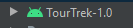
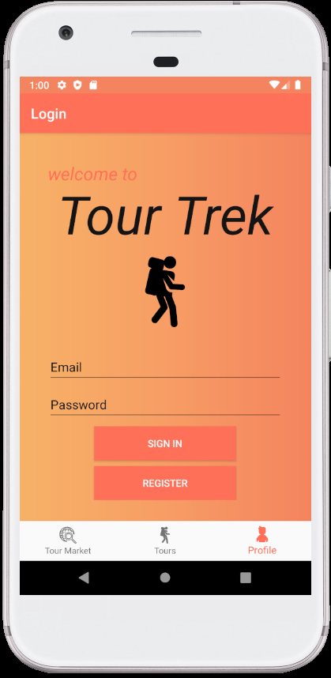
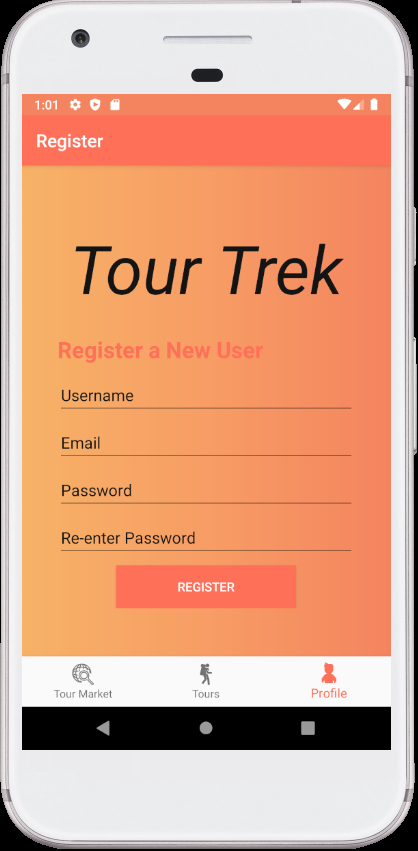
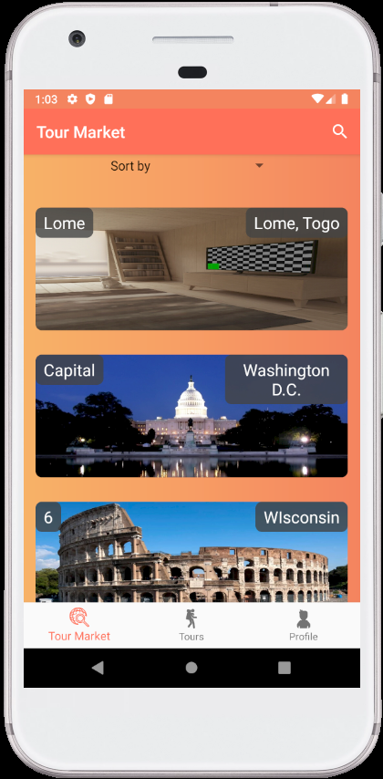
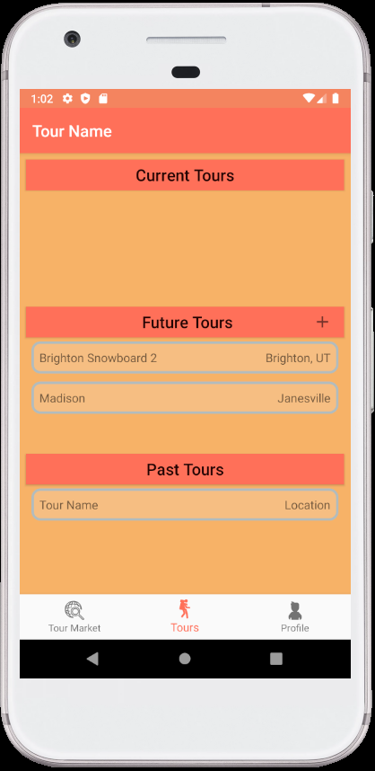
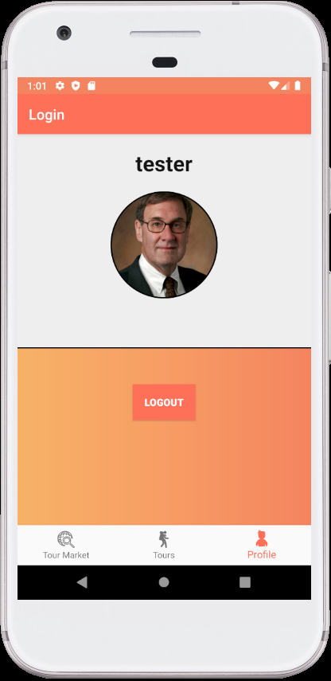
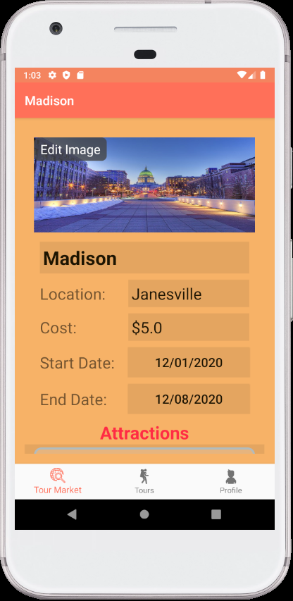

# TourTrek

  

TourTrek is an android application developed for those who love to explore new places. In this application, a user can create their own personal account where they can keep track of excursions they decide to embark on. Users can create a Tour, which includes a location, date, and name. Tours consist of attractions a user would like to attend, which can range anywhere from restaurants to amusement parks. Each attraction can store its name, location, cost, and date to keep track of what time/date you want to attend each attraction with reminders included. TourTrek also features a public tour market where you can explore tours that other users have completed and embark on these excursions yourself.

## Configuring Development Environment

### Requirements

- [Android Studio 4.1](https://developer.android.com/studio/index.html)
- [Git](https://git-scm.com/downloads)

### Setup

1. Make sure all the required software mentioned above are installed

2. Open Project in Android Studio (Windows):
    * Download latest release from here: https://github.com/JohnBednarczyk/TourTrek/releases
    * Unzip file to target destination
    * Open Android Studio and click "Open an Existing Project"
    * Select Directory of un-zipped file from above
    * Wait for project to load and build (Once you see all loading bars disappear from the bottom)
      
3. Setup Android Emulator:
    * Select Tools --> AVD Manager:
    * Select + Create Virtual Device... (Bottom Left)
    * Select Pixel 2 --> Next
    * Download <Pie, 28, x86, Android 9.0 (Google Play)>
    * Select <Pie, 28, x86, Android 9.0 (Google Play)> --> Next
    * Keep all defaults and select Finish
    * Exit AVD Manager
    
4. Build and Sync Gradle:
    * Select Build --> Make Project
    * Wait for project status to display “gradle build finished” (located in the bottom left corner of Android Studio)
    * Select File --> Sync Project with Gradle Files
    * Wait for project status to display “Gradle Sync Finished”

5. Run Application:
    * Select Run --> Run...
    * Select app from popup screen
    * App should begin running in the emulator
     
## Testing
* Run All Instrumentation Unit Tests:
    * From the Project Directory tab open app/java/
    * Right click on com.tourtrek(androidTest) to run all Instrumentation Unit Tests
    * Click Run 'Tests in 'com.tourtr...'
    * Click Run
    
* Run An Instrumentation Unit Test Class:
    * From the Project Directory tab open app/java/com.tourtrek(androidTest)
    * Right click on a specific test class
    * Click Run '<Name of class>'
    
* Run A Single Instrumentation Unit Test:
    * From the Project Directory tab open app/java/com.tourtrek(androidTest)
    * Open the test class file of the test you want to run
    * Click the play symbol next to the individual test you want to run

* Run A Code Coverage Test:
    * Open the Gradle sidebar navigator view
    * Navigate to TourTrek --> Tasks --> verification
    * Double click "createDebugCoverageReport"
    * Wait for project status to display "Gradle build finished"
    * In the project directory, navigate to app --> build --> reports --> coverage --> debug
    * Open index.html with a web browser to view full code coverage report

## FAQ

  
I can't see the AVD Manager in Tools --> AVD Manager

  

   This is because when you unzipped the release zip file, you added an additional folder on top of the app folder. When you import the project, it should show the android icon next to the folder like so:

By selecting a folder with this icon, you will correctly import the project

Also keep in mind that once you import a project, regardless of whether or not it was successful, android studio will convert it into an android project and give that folder the icon above, giving you a false positive
      

  
Gradle Build never completes

  
Restart Android Studio

## Screenshots

| Login | Register | Tour Market |
|:-:|:-:|:-:|
|  |  |  |

| Personal Tours | Profile | Tour Top |
|:-:|:-:|:-:|
|  |  |  |

| Tour Bottom |
|:-:|
|  |
